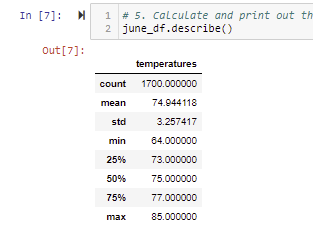
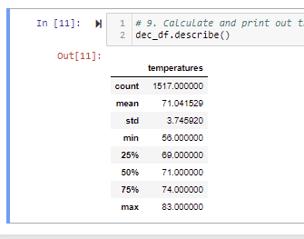

# Surfs Up Challenege

## Overview
- We want to live in the dream destiantion of Oahu and open a combination shop that sells surf products and ice cream. In order to secure a big investor, W. Avy, we need statistical proof that our chosen location will attract plenty of customers. We can do this by proving that the weather is warm and sunny OFTEN!

- Resources: 
    - SQLite and PostgreSQL databases
    - SQL Alchemy to connect to and query a SQLite database
    - Flask to design an application

## Results
- There is very little difference between the mean temperature in June and December. June is less than 3 degrees warmer on average.
- There is very little difference between the maximum temperature in June and December. June is only 2 degrees warmer on average. 
- The largest deficit is between the June minimium temperature of 64 degrees and the December minimium of 56 degrees.

- June Results

- December Results

## Summary

- Based on the data pulled together so far, our surf and ice cream shop is looking promising as a business model. Even though the minimium temperature in December was 56, this is not extremely concerning because that is not a freezing temperture. At best, it will just mean more surf wetsuit sales. 
- Two other queries we could do to add to this anaysis would be to query the June and December precipitation results and turn that data into statsistics as well.
